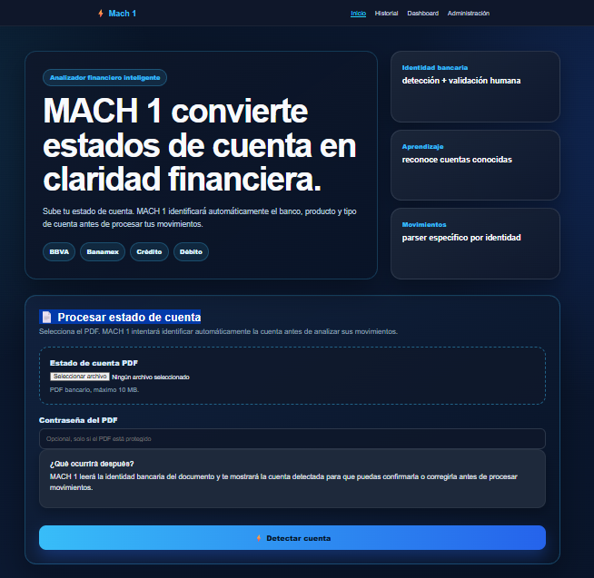
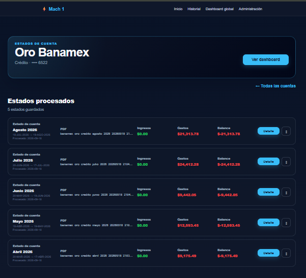
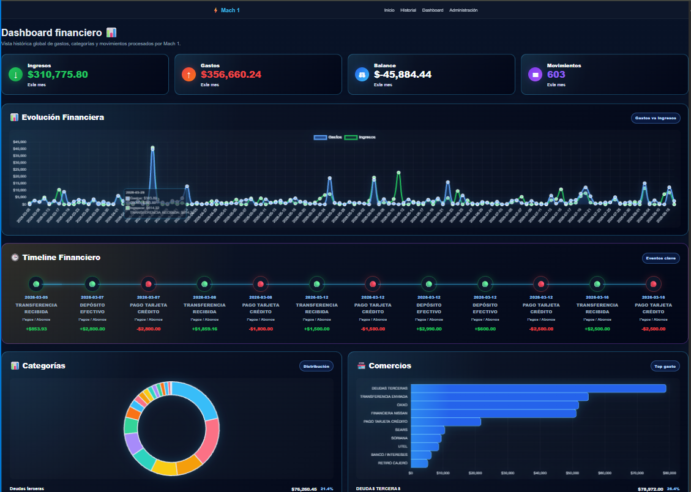
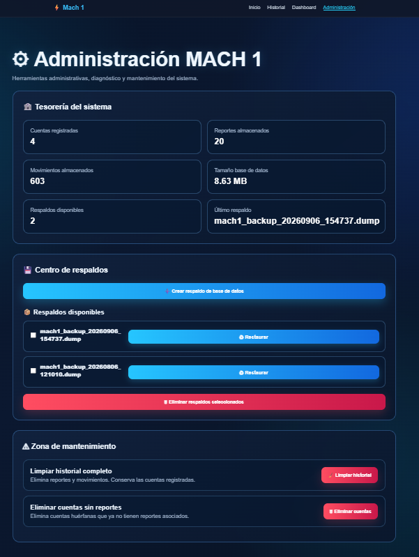

# MACH 1 — Plataforma de Procesamiento y Análisis de Datos Financieros

**Proyecto de portafolio | Python · Procesamiento de datos · Backend · Analytics**

MACH 1 es un proyecto personal de ingeniería de software diseñado para transformar información contenida en estados de cuenta bancarios en formato PDF en datos estructurados, validados y preparados para su análisis.

El proyecto trabaja sobre un flujo completo de datos:

**Carga de PDF → extracción → transformación → validación → persistencia → análisis → visualización**

> Este repositorio es un caso de estudio público del proyecto MACH 1.
> El código fuente completo y los datos financieros utilizados durante el desarrollo permanecen en un repositorio privado.

---

## 🎯 Objetivo del proyecto

Los estados de cuenta contienen información financiera importante, pero normalmente están diseñados para ser leídos por personas y no para ser procesados automáticamente.

MACH 1 fue creado para investigar y desarrollar una solución capaz de convertir estos documentos en información financiera estructurada que posteriormente pueda utilizarse para:

* Analizar movimientos financieros.
* Identificar ingresos y gastos.
* Construir dashboards financieros.
* Consultar históricos por cuenta.
* Validar información extraída.
* Analizar tendencias financieras.
* Servir como base para futuras herramientas de apoyo a la toma de decisiones.

---

## ⚙️ Flujo principal de datos

```text
Estado de cuenta bancario PDF
            │
            ▼
Validación del archivo
            │
            ▼
Extracción de información
            │
            ▼
Detección de institución bancaria
            │
            ▼
Parser específico
            │
            ▼
Limpieza y normalización
            │
            ▼
Procesamiento con pandas / DataFrames
            │
            ▼
Validación y enriquecimiento
            │
            ▼
Persistencia en PostgreSQL
            │
            ▼
API REST
            │
            ▼
Analytics y Dashboards
```

---

## 🧰 Tecnologías utilizadas

### Backend y procesamiento de datos

* Python
* Flask
* pandas
* PostgreSQL
* SQLAlchemy
* APIs REST

### Procesamiento documental

* pdfplumber
* OCR dirigido
* Parsers basados en reglas
* Normalización y validación de datos

### Calidad de software

* pytest
* Ruff
* Git
* GitHub Actions
* Pruebas automatizadas de regresión

### Frontend y visualización

* HTML
* CSS
* JavaScript
* Chart.js

### Tecnologías adicionales

* Alembic para migraciones de base de datos
* Configuración Docker
* Power BI *(actualmente en proceso de aprendizaje mediante un proyecto práctico de portafolio)*

---

## 🏗️ Arquitectura del software

MACH 1 utiliza una arquitectura por capas para separar responsabilidades y facilitar el mantenimiento, las pruebas y la evolución del sistema.

```text
Routes
   ↓
Services
   ↓
Repositories
   ↓
Models / Base de datos
```

Además, existen componentes especializados encargados de:

```text
Procesamiento de PDFs
Parsers bancarios
Extracción de información financiera
Identificación de cuentas
Validación de datos
Analytics
```

Esta separación permite modificar o mejorar componentes específicos sin acoplar excesivamente todo el sistema.

---

## 🔐 Privacidad y alcance de este repositorio

El código fuente completo de MACH 1 permanece en un repositorio privado debido a que el proyecto trabaja con procesamiento de documentación financiera y conjuntos de datos utilizados durante su desarrollo.

Este repositorio público tiene como objetivo documentar:

* La arquitectura del sistema.
* Las decisiones de ingeniería.
* Las tecnologías utilizadas.
* Los flujos de procesamiento de datos.
* Capturas y demostraciones del proyecto.
* Problemas técnicos encontrados y sus soluciones.
* La evolución del proyecto.

Aquí no se publican:

* Credenciales bancarias.
* Información financiera personal.
* Estados de cuenta reales.
* Contraseñas.
* Bases de datos privadas.
* Datos confidenciales.

## 🧩 Retos técnicos y soluciones

Durante el desarrollo de MACH 1 han surgido distintos problemas relacionados con procesamiento documental, calidad de datos, arquitectura y mantenimiento del software.

Algunos de los retos trabajados hasta ahora son:

### Extracción de información desde diferentes formatos bancarios

Los estados de cuenta no mantienen una estructura uniforme entre instituciones y productos.

**Solución aplicada:**
Se desarrolló una arquitectura de parsers especializados por institución bancaria, complementada con mecanismos de detección y normalización de información.

---

### Información difícil de recuperar desde PDFs

Algunos documentos contienen información que no puede extraerse correctamente utilizando únicamente texto nativo.

**Solución aplicada:**
Se desarrolló un enfoque multicapa que combina extracción de texto, análisis de estructura/layout y OCR dirigido sobre regiones específicas del documento.

---

### Normalización y calidad de datos

La información extraída puede contener formatos distintos de fechas, descripciones, valores monetarios o caracteres dañados.

**Solución aplicada:**
Se implementaron procesos de limpieza, normalización y validación antes de persistir la información.

---

### Separación de responsabilidades

A medida que MACH 1 creció, concentrar toda la lógica en pocos archivos habría dificultado las pruebas y el mantenimiento.

**Solución aplicada:**
El sistema evolucionó hacia una arquitectura por capas utilizando rutas, servicios, repositorios, modelos y componentes especializados.

---

### Prevención de regresiones

Los cambios realizados en parsers, servicios o persistencia pueden afectar funcionalidades previamente estables.

**Solución aplicada:**
Se incorporaron pruebas automatizadas con pytest y validaciones continuas para detectar regresiones durante la evolución del proyecto.

---

### Evolución de la persistencia de datos

El proyecto inició utilizando SQLite como solución local y posteriormente evolucionó hacia PostgreSQL para disponer de una base de datos más adecuada para crecimiento y operación futura.

**Solución aplicada:**
Se incorporaron PostgreSQL, SQLAlchemy y migraciones de esquema mediante Alembic.

## 🖥️ Capturas del proyecto

Las siguientes imágenes muestran diferentes etapas del funcionamiento actual de MACH 1.

> Las capturas utilizan información anonimizada y los identificadores personales o bancarios se encuentran ocultos o enmascarados.

---

### 1. Pantalla principal

MACH 1 permite cargar un estado de cuenta bancario en formato PDF e iniciar automáticamente el proceso de identificación de institución, producto y tipo de cuenta antes de analizar sus movimientos.



---

### 2. Identificación y procesamiento del estado de cuenta

Después de analizar el documento, MACH 1 identifica la cuenta bancaria y permite revisar la información detectada antes de continuar con el procesamiento financiero.

Esta etapa forma parte del flujo de validación diseñado para evitar que información incorrecta sea almacenada automáticamente.


---

### 3. Historial de estados de cuenta

Los documentos procesados quedan organizados por cuenta bancaria, permitiendo consultar diferentes periodos históricos y acceder posteriormente a sus detalles y análisis.



---

### 4. Dashboard financiero global

La información estructurada puede analizarse mediante dashboards que muestran ingresos, gastos, balance, movimientos, evolución temporal, categorías y comercios.

Esta capa transforma los datos procesados en información visual que facilita su interpretación.



---

### 5. Administración y mantenimiento

MACH 1 también incorpora herramientas administrativas para supervisar cuentas, reportes, movimientos almacenados, tamaño de la base de datos y respaldos.

El sistema permite crear y restaurar respaldos, además de ejecutar operaciones controladas de mantenimiento.


